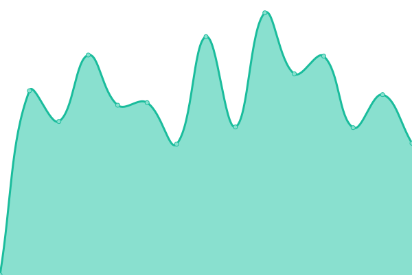
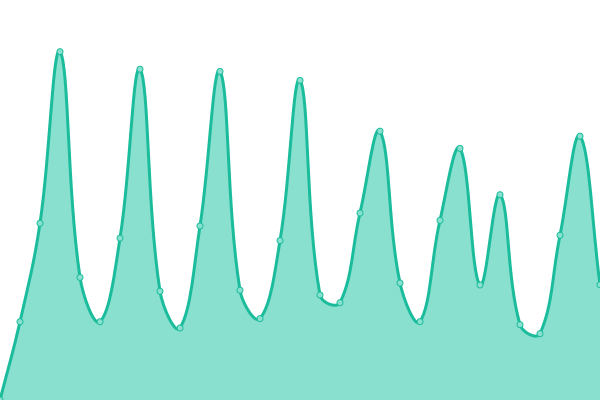

# [📈 Live Status](https://joaopmoreira.github.io/services-status): <!--live status--> **🟧 Partial outage**

This repository contains the open-source uptime monitor and status page for [joaopmoreira](https://joaopmoreira.github.io/services-status), powered by [Upptime](https://github.com/upptime/upptime).

With [Upptime](https://upptime.js.org), you can get your own unlimited and free uptime monitor and status page, powered entirely by a GitHub repository. We use [Issues](https://github.com/joaopmoreira/services-status/issues) as incident reports, [Actions](https://github.com/joaopmoreira/services-status/actions) as uptime monitors, and [Pages](https://joaopmoreira.github.io/services-status) for the status page.

<!--start: status pages-->
<!-- This summary is generated by Upptime (https://github.com/upptime/upptime) -->
<!-- Do not edit this manually, your changes will be overwritten -->
<!-- prettier-ignore -->
| URL | Status | History | Response Time | Uptime |
| --- | ------ | ------- | ------------- | ------ |
|  [100fitclub](https://100fitclub.com) | 🟩 Up | [100fitclub.yml](https://github.com/joaopmoreira/services-status/commits/HEAD/history/100fitclub.yml) | 

 1392ms
     
 | 

<a href="https://joaopmoreira.github.io/services-status/history/100fitclub">100.00%</a>
    

|  [amr-classicdrive](https://amr-classicdrive.pt) | 🟩 Up | [amr-classicdrive.yml](https://github.com/joaopmoreira/services-status/commits/HEAD/history/amr-classicdrive.yml) | 

 1245ms
     
 | 

<a href="https://joaopmoreira.github.io/services-status/history/amr-classicdrive">100.00%</a>
    

|  [amr-imoveis](https://amr-imoveis.pt) | 🟩 Up | [amr-imoveis.yml](https://github.com/joaopmoreira/services-status/commits/HEAD/history/amr-imoveis.yml) | 

 2594ms
     
 | 

<a href="https://joaopmoreira.github.io/services-status/history/amr-imoveis">100.00%</a>
    

|  [App 100fitclub](https://app.100fitclub.com) | 🟩 Up | [app-100fitclub.yml](https://github.com/joaopmoreira/services-status/commits/HEAD/history/app-100fitclub.yml) | 

 1047ms
     
 | 

<a href="https://joaopmoreira.github.io/services-status/history/app-100fitclub">100.00%</a>
    

|  [benali](https://benali.org) | 🟩 Up | [benali.yml](https://github.com/joaopmoreira/services-status/commits/HEAD/history/benali.yml) | 

 2225ms
     
 | 

<a href="https://joaopmoreira.github.io/services-status/history/benali">100.00%</a>
    

|  [prosnowlife](https://prosnowlife.com) | 🟩 Up | [prosnowlife.yml](https://github.com/joaopmoreira/services-status/commits/HEAD/history/prosnowlife.yml) | 

 1426ms
     
 | 

<a href="https://joaopmoreira.github.io/services-status/history/prosnowlife">99.91%</a>
    

|  [ricardoguiomar](https://ricardoguiomar.pt) | 🟩 Up | [ricardoguiomar.yml](https://github.com/joaopmoreira/services-status/commits/HEAD/history/ricardoguiomar.yml) | 

 2704ms
     
 | 

<a href="https://joaopmoreira.github.io/services-status/history/ricardoguiomar">100.00%</a>
    

|  [diamondsevents](https://diamondsevents.org) | 🟩 Up | [diamondsevents.yml](https://github.com/joaopmoreira/services-status/commits/HEAD/history/diamondsevents.yml) | 

 2210ms
     
 | 

<a href="https://joaopmoreira.github.io/services-status/history/diamondsevents">100.00%</a>
    

|  [dlgportas](https://dlgportas.com) | 🟩 Up | [dlgportas.yml](https://github.com/joaopmoreira/services-status/commits/HEAD/history/dlgportas.yml) | 

 1598ms
     
 | 

<a href="https://joaopmoreira.github.io/services-status/history/dlgportas">100.00%</a>
    

|  [dropandlock](https://dropandlock.pt) | 🟩 Up | [dropandlock.yml](https://github.com/joaopmoreira/services-status/commits/HEAD/history/dropandlock.yml) | 

 1219ms
     
 | 

<a href="https://joaopmoreira.github.io/services-status/history/dropandlock">100.00%</a>
    

|  [fatorx](https://fatorx.pt) | 🟩 Up | [fatorx.yml](https://github.com/joaopmoreira/services-status/commits/HEAD/history/fatorx.yml) | 

 866ms
     
 | 

<a href="https://joaopmoreira.github.io/services-status/history/fatorx">100.00%</a>
    

|  [fatorx](https://formacao.fatorx.pt) | 🟩 Up | [fatorx.yml](https://github.com/joaopmoreira/services-status/commits/HEAD/history/fatorx.yml) | 

 866ms
     
 | 

<a href="https://joaopmoreira.github.io/services-status/history/fatorx">100.00%</a>
    

|  [jvparts](https://jvparts.pt) | 🟩 Up | [jvparts.yml](https://github.com/joaopmoreira/services-status/commits/HEAD/history/jvparts.yml) | 

 499ms
     
 | 

<a href="https://joaopmoreira.github.io/services-status/history/jvparts">100.00%</a>
    

|  [projetomatic](https://loja.projetomatic.pt) | 🟩 Up | [projetomatic.yml](https://github.com/joaopmoreira/services-status/commits/HEAD/history/projetomatic.yml) | 

 2327ms
     
 | 

<a href="https://joaopmoreira.github.io/services-status/history/projetomatic">100.00%</a>
    

|  [mafaldagranado](https://mafaldagranado.com) | 🟩 Up | [mafaldagranado.yml](https://github.com/joaopmoreira/services-status/commits/HEAD/history/mafaldagranado.yml) | 

 3698ms
     
 | 

<a href="https://joaopmoreira.github.io/services-status/history/mafaldagranado">100.00%</a>
    

|  [visualwebdesign](https://my.visualwebdesign.pt) | 🟩 Up | [visualwebdesign.yml](https://github.com/joaopmoreira/services-status/commits/HEAD/history/visualwebdesign.yml) | 

 2672ms
     
 | 

<a href="https://joaopmoreira.github.io/services-status/history/visualwebdesign">100.00%</a>
    

|  [visualwebdesign](https://new.visualwebdesign.pt) | 🟩 Up | [visualwebdesign.yml](https://github.com/joaopmoreira/services-status/commits/HEAD/history/visualwebdesign.yml) | 

 2672ms
     
 | 

<a href="https://joaopmoreira.github.io/services-status/history/visualwebdesign">100.00%</a>
    

|  [paivasom](https://paivasom.com) | 🟩 Up | [paivasom.yml](https://github.com/joaopmoreira/services-status/commits/HEAD/history/paivasom.yml) | 

 1343ms
     
 | 

<a href="https://joaopmoreira.github.io/services-status/history/paivasom">100.00%</a>
    

|  [parquemonteverde](https://parquemonteverde.com) | 🟩 Up | [parquemonteverde.yml](https://github.com/joaopmoreira/services-status/commits/HEAD/history/parquemonteverde.yml) | 

 2057ms
     
 | 

<a href="https://joaopmoreira.github.io/services-status/history/parquemonteverde">100.00%</a>
    

|  [phunkpt](https://phunk.pt) | 🟥 Down | [phunkpt.yml](https://github.com/joaopmoreira/services-status/commits/HEAD/history/phunkpt.yml) | 

 97ms
     
 | 

<a href="https://joaopmoreira.github.io/services-status/history/phunkpt">0.00%</a>
    

|  [projetomatic](https://projetomatic.pt) | 🟩 Up | [projetomatic.yml](https://github.com/joaopmoreira/services-status/commits/HEAD/history/projetomatic.yml) | 

 2327ms
     
 | 

<a href="https://joaopmoreira.github.io/services-status/history/projetomatic">100.00%</a>
    

|  [prosnowlife](https://prosnowlife.com) | 🟩 Up | [prosnowlife.yml](https://github.com/joaopmoreira/services-status/commits/HEAD/history/prosnowlife.yml) | 

 1426ms
     
 | 

<a href="https://joaopmoreira.github.io/services-status/history/prosnowlife">99.91%</a>
    

|  [ricardoguiomar](https://ricardoguiomar.pt) | 🟩 Up | [ricardoguiomar.yml](https://github.com/joaopmoreira/services-status/commits/HEAD/history/ricardoguiomar.yml) | 

 2704ms
     
 | 

<a href="https://joaopmoreira.github.io/services-status/history/ricardoguiomar">100.00%</a>
    

|  [terrierclubedepo](https://terrierclubedeportugal.pt) | 🟩 Up | [terrierclubedepo.yml](https://github.com/joaopmoreira/services-status/commits/HEAD/history/terrierclubedepo.yml) | 

 1205ms
     
 | 

<a href="https://joaopmoreira.github.io/services-status/history/terrierclubedepo">100.00%</a>
    

|  [ultralogic](https://ultra-logic.pt) | 🟩 Up | [ultralogic.yml](https://github.com/joaopmoreira/services-status/commits/HEAD/history/ultralogic.yml) | 

 1316ms
     
 | 

<a href="https://joaopmoreira.github.io/services-status/history/ultralogic">100.00%</a>
    

|  [villasjoinal](https://villasjoinal.com) | 🟩 Up | [villasjoinal.yml](https://github.com/joaopmoreira/services-status/commits/HEAD/history/villasjoinal.yml) | 

 1980ms
     
 | 

<a href="https://joaopmoreira.github.io/services-status/history/villasjoinal">100.00%</a>
    

|  [visualwebdesign](https://visualwebdesign.net) | 🟩 Up | [visualwebdesign.yml](https://github.com/joaopmoreira/services-status/commits/HEAD/history/visualwebdesign.yml) | 

 2672ms
     
 | 

<a href="https://joaopmoreira.github.io/services-status/history/visualwebdesign">100.00%</a>
    

|  [visualwebdesign](https://visualwebdesign.pt) | 🟩 Up | [visualwebdesign.yml](https://github.com/joaopmoreira/services-status/commits/HEAD/history/visualwebdesign.yml) | 

 2672ms
     
 | 

<a href="https://joaopmoreira.github.io/services-status/history/visualwebdesign">100.00%</a>
    

|  HTTP | 🟩 Up | [http.yml](https://github.com/joaopmoreira/services-status/commits/HEAD/history/http.yml) | 

 104ms
     
 | 

<a href="https://joaopmoreira.github.io/services-status/history/http">100.00%</a>
    

|  IMAP | 🟩 Up | [imap.yml](https://github.com/joaopmoreira/services-status/commits/HEAD/history/imap.yml) | 

 103ms
     
 | 

<a href="https://joaopmoreira.github.io/services-status/history/imap">100.00%</a>
    

|  POP3 | 🟩 Up | [pop-3.yml](https://github.com/joaopmoreira/services-status/commits/HEAD/history/pop-3.yml) | 

 104ms
     
 | 

<a href="https://joaopmoreira.github.io/services-status/history/pop-3">100.00%</a>
    

|  SMTP | 🟩 Up | [smtp.yml](https://github.com/joaopmoreira/services-status/commits/HEAD/history/smtp.yml) | 

 103ms
     
 | 

<a href="https://joaopmoreira.github.io/services-status/history/smtp">100.00%</a>
    

<!--end: status pages-->

[**Visit our status website →**](https://joaopmoreira.github.io/services-status)

## 📄 License

- Powered by: [Upptime](https://github.com/upptime/upptime)
- Code: [MIT](./LICENSE) © [joaopmoreira](https://joaopmoreira.github.io/services-status)
- Data in the `./history` directory: [Open Database License](https://opendatacommons.org/licenses/odbl/1-0/)
